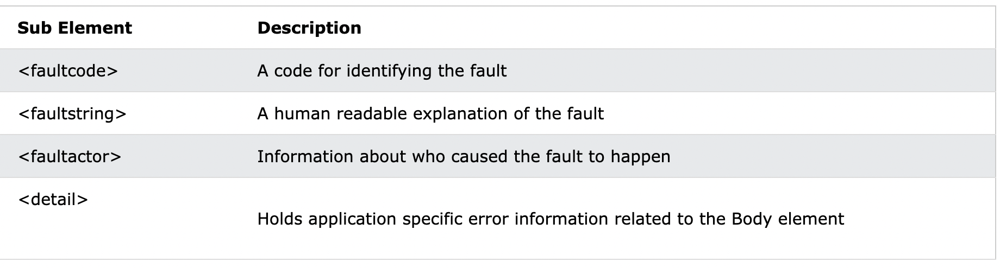
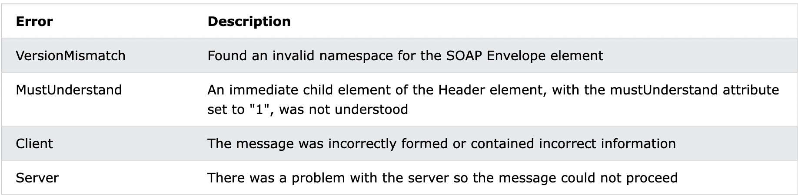

# SOAP

- SOAP stands for Simple Object Access Protocol
- SOAP is an application communication protocol
- SOAP is a format for sending and receiving messages
- SOAP is platform independent
- SOAP is based on XML
- SOAP is a W3C recommendation

## Why SOAP

The best way to communicate between applications is over HTTP, because HTTP is supported by all Internet browsers and servers. SOAP was created to accomplish this.

SOAP provides a way to communicate between applications running on different operating systems, with different technologies and programming languages.

## SOAP Building Blocks

A SOAP message is an ordinary XML document containing the following elements:

- An Envelope element that identifies the XML document as a SOAP message
- A Header element that contains header information
- A Body element that contains call and response information
- A Fault element containing errors and status information

### Syntax Rules

- A SOAP message MUST be encoded using XML
- A SOAP message MUST use the SOAP Envelope namespace
- A SOAP message must NOT contain a DTD reference
- A SOAP message must NOT contain XML Processing Instructions

## Skeleton SOAP Message

```SOAP
<?xml version="1.0"?>

<soap:Envelope
xmlns:soap="http://www.w3.org/2003/05/soap-envelope/"
soap:encodingStyle="http://www.w3.org/2003/05/soap-encoding">

<soap:Header>
...
</soap:Header>

<soap:Body>
...
  <soap:Fault>
  ...
  </soap:Fault>
</soap:Body>

</soap:Envelope>
```

## The SOAP Envelope Element

The required SOAP Envelope element is the root element of a SOAP message. This element defines the XML document as a SOAP message.

```SOAP
<?xml version="1.0"?>

<soap:Envelope
xmlns:soap="http://www.w3.org/2003/05/soap-envelope/"
soap:encodingStyle="http://www.w3.org/2003/05/soap-encoding">
  ...
  Message information goes here
  ...
</soap:Envelope>
```

## The xmlns:soap Namespace

Notice the xmlns:soap namespace in the example above. It should always have the value of: "http://www.w3.org/2003/05/soap-envelope/".


## The encodingStyle Attribute

The encodingStyle attribute is used to define the data types used in the document. This attribute may appear on any SOAP element, and applies to the element's contents and all child elements.

`A SOAP message has no default encoding`.

#### Syntax

```SOAP
soap:encodingStyle="URI"
```

## The SOAP Header Element

- The `optional` SOAP Header element contains application-specific information (like authentication, payment, etc) about the SOAP message.
- If the Header element is present, it must be the first child element of the Envelope element.

**All immediate child elements of the Header element must be namespace-qualified.**

```SOAP
<?xml version="1.0"?>

<soap:Envelope
xmlns:soap="http://www.w3.org/2003/05/soap-envelope/"
soap:encodingStyle="http://www.w3.org/2003/05/soap-encoding">

<soap:Header>
  <m:Trans xmlns:m="https://www.w3schools.com/transaction/"
  soap:mustUnderstand="1">234
  </m:Trans>
</soap:Header>
...
...
</soap:Envelope>
```

The example above contains a header with a "Trans" element, a "mustUnderstand" attribute with a value of 1, and a value of 234.

SOAP defines three attributes in the default namespace. These attributes are: `mustUnderstand, actor, and encodingStyle`.

The attributes defined in the SOAP Header defines how a recipient should process the SOAP message.

## The mustUnderstand Attribute

The SOAP mustUnderstand attribute can be used to indicate whether a `header entry is mandatory or optional` for the recipient to process.

If you add mustUnderstand="1" to a child element of the Header element it indicates that the receiver processing the Header must recognize the element. If the receiver does not recognize the element it will fail when processing the Header.

## The actor Attribute

A SOAP message may travel from a sender to a receiver by passing different endpoints along the message path. However, not all parts of a SOAP message may be intended for the ultimate endpoint, instead, it may be intended for one or more of the endpoints on the message path.

The SOAP actor attribute is used to `address the Header element` to a specific endpoint.

## The SOAP Body Element

The `required SOAP Body element` contains the actual SOAP message intended for the ultimate endpoint of the message.

Immediate child elements of the SOAP Body element may be namespace-qualified.

```SOAP request
<?xml version="1.0"?>

<soap:Envelope
xmlns:soap="http://www.w3.org/2003/05/soap-envelope/"
soap:encodingStyle="http://www.w3.org/2003/05/soap-encoding">

<soap:Body>
  <m:GetPrice xmlns:m="https://www.w3schools.com/prices">
    <m:Item>Apples</m:Item>
  </m:GetPrice>
</soap:Body>

</soap:Envelope>
```

```SOAP response
<?xml version="1.0"?>

<soap:Envelope
xmlns:soap="http://www.w3.org/2003/05/soap-envelope/"
soap:encodingStyle="http://www.w3.org/2003/05/soap-encoding">

<soap:Body>
  <m:GetPriceResponse xmlns:m="https://www.w3schools.com/prices">
    <m:Price>1.90</m:Price>
  </m:GetPriceResponse>
</soap:Body>

</soap:Envelope>
```

## The SOAP Fault Element

The `optional` SOAP Fault element is used to indicate error messages.

The SOAP Fault element holds `errors` and `status` information for a SOAP message.

If a Fault element is present, it must appear `as a child element of the Body element`. A Fault element can `only appear once` in a SOAP message.



### SOAP Fault Codes



## The HTTP Protocol

[LINK](https://www.w3schools.com/xml/xml_soap.asp)

## SOAP Binding

Most SOAP implementations provide bindings for common transport protocols, such as `HTTP` or `SMTP`.

## Content-Type

The Content-Type header for a SOAP request and response defines the `MIME type` for the message and the `character encoding (optional)` used for the XML body of the request or response.

Example:

```charactor
POST /item HTTP/1.1
Content-Type: application/soap+xml; charset=utf-8
```

## Content-Length

The Content-Length header for a SOAP request and response specifies the number of bytes in the body of the request or response.

Example:

```charactor
POST /item HTTP/1.1
Content-Type: application/soap+xml; charset=utf-8
Content-Length: 250
```

## A SOAP Example

```SOAP request
POST /InStock HTTP/1.1
Host: www.example.org
Content-Type: application/soap+xml; charset=utf-8
Content-Length: nnn

<?xml version="1.0"?>

<soap:Envelope
xmlns:soap="http://www.w3.org/2003/05/soap-envelope/"
soap:encodingStyle="http://www.w3.org/2003/05/soap-encoding">

<soap:Body xmlns:m="http://www.example.org/stock">
  <m:GetStockPrice>
    <m:StockName>IBM</m:StockName>
  </m:GetStockPrice>
</soap:Body>

</soap:Envelope>
```

```SOAP response
HTTP/1.1 200 OK
Content-Type: application/soap+xml; charset=utf-8
Content-Length: nnn

<?xml version="1.0"?>

<soap:Envelope
xmlns:soap="http://www.w3.org/2003/05/soap-envelope/"
soap:encodingStyle="http://www.w3.org/2003/05/soap-encoding">

<soap:Body xmlns:m="http://www.example.org/stock">
  <m:GetStockPriceResponse>
    <m:Price>34.5</m:Price>
  </m:GetStockPriceResponse>
</soap:Body>

</soap:Envelope>
```

## XML Namespaces

### Name Conflicts

If these XML fragments were added together, there would be a name conflict.

### Solving the Name Conflict Using a Prefix

```xml
<h:table>
  <h:tr>
    <h:td>Apples</h:td>
    <h:td>Bananas</h:td>
  </h:tr>
</h:table>

<f:table>
  <f:name>African Coffee Table</f:name>
  <f:width>80</f:width>
  <f:length>120</f:length>
</f:table>
```

### XML Namespaces - The xmlns Attribute

When using prefixes in XML, a namespace for the prefix must be defined.

The namespace declaration has the following syntax. xmlns:prefix="URI".

```xml
<root>

<h:table xmlns:h="http://www.w3.org/TR/html4/">
  <h:tr>
    <h:td>Apples</h:td>
    <h:td>Bananas</h:td>
  </h:tr>
</h:table>

<f:table xmlns:f="https://www.w3schools.com/furniture">
  <f:name>African Coffee Table</f:name>
  <f:width>80</f:width>
  <f:length>120</f:length>
</f:table>

</root>
```

Namespaces can also be declared in the XML root element:

```xml
<root xmlns:h="http://www.w3.org/TR/html4/"
xmlns:f="https://www.w3schools.com/furniture">

<h:table>
  <h:tr>
    <h:td>Apples</h:td>
    <h:td>Bananas</h:td>
  </h:tr>
</h:table>

<f:table>
  <f:name>African Coffee Table</f:name>
  <f:width>80</f:width>
  <f:length>120</f:length>
</f:table>

</root>
```

> **Note**: The namespace URI is not used by the parser to look up information.
> The purpose of using an URI is to give the namespace a unique name.
> However, companies often use the namespace as a pointer to a web page containing namespace information.

### Default Namespaces

Defining a default namespace for an element saves us from using prefixes in all the child elements. It has the following syntax:

```xml
xmlns="namespaceURI"
```

This XML carries HTML table information:

```xml
<table xmlns="http://www.w3.org/TR/html4/">
  <tr>
    <td>Apples</td>
    <td>Bananas</td>
  </tr>
</table>
```

This XML carries information about a piece of furniture:

```xml
<table xmlns="https://www.w3schools.com/furniture">
  <name>African Coffee Table</name>
  <width>80</width>
  <length>120</length>
</table>
```

### Namespaces in Real Use

XSLT is a language that can be used to transform XML documents into other formats.

The XML document below, is a document used to transform XML into HTML.

The namespace "http://www.w3.org/1999/XSL/Transform" identifies XSLT elements inside an HTML document:

```xml
<?xml version="1.0" encoding="UTF-8"?>

<xsl:stylesheet version="1.0" xmlns:xsl="http://www.w3.org/1999/XSL/Transform">

<xsl:template match="/">
<html>
<body>
  <h2>My CD Collection</h2>
  <table border="1">
    <tr>
      <th style="text-align:left">Title</th>
      <th style="text-align:left">Artist</th>
    </tr>
    <xsl:for-each select="catalog/cd">
    <tr>
      <td><xsl:value-of select="title"/></td>
      <td><xsl:value-of select="artist"/></td>
    </tr>
    </xsl:for-each>
  </table>
</body>
</html>
</xsl:template>

</xsl:stylesheet>
```

## References

- [W3C](https://www.w3schools.com/xml/xml_soap.asp)